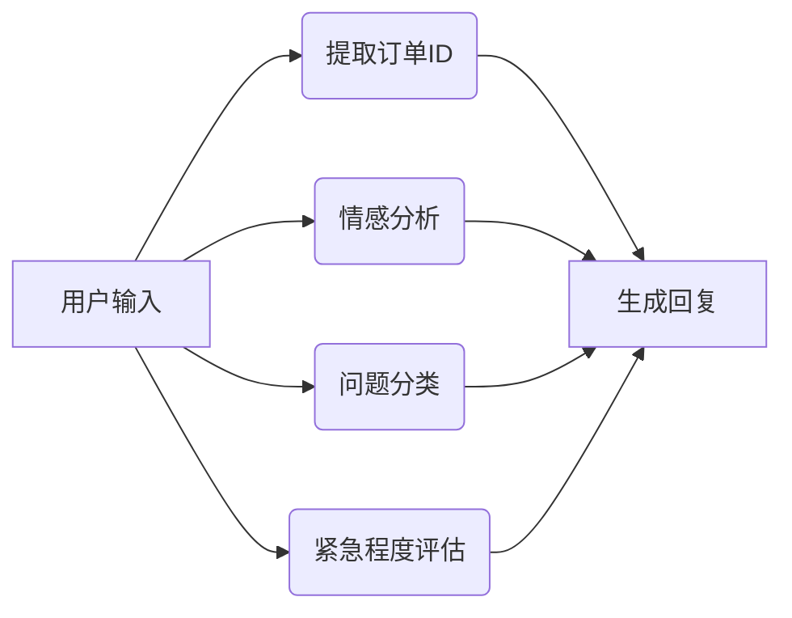
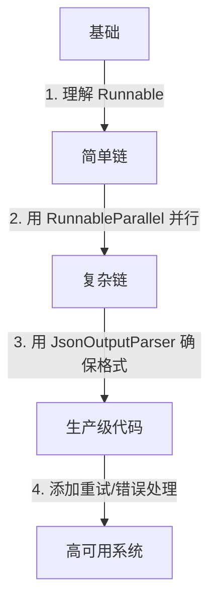

# LangChain 1.0 样例解析：电商客户反馈处理系统

> 本文基于 `01_project_demo1.py` 代码，为新手提供 LangChain 1.0 实战解析。我们将从**核心概念→代码结构→生产实践**层层递进，帮助你快速掌握 LangChain 1.0 的精髓。

---

## 一、LangChain 1.0 核心概念（新手必读）

在深入代码前，先理解 LangChain 1.0 的**三大基石**：


| 概念             | 作用                     | 类比     | 代码体现                             |
| ---------------- | ------------------------ | -------- | ------------------------------------ |
| **Runnable**     | 执行单元（函数/链/模型） | 零件     | `RunnableParallel`, `RunnableLambda` |
| **Chain**        | 串联 Runnable 的流程     | 生产线   | `processing_chain`                   |
| **OutputParser** | 格式化输出               | 产品质检 | `JsonOutputParser`                   |

> 💡 **关键区别**：LangChain 1.0 用 **`Runnable` 代替 `Chain`**，强调**可组合性**（类似乐高积木）

---

## 二、代码结构深度解析

### 1. 核心流程图解



### 2. 模块化代码拆解（按功能层级）

#### ✅ 模块 1：订单ID提取（`extract_order_id`）

```python
def extract_order_id(user_input: str) -> dict:
    prompt = f"你是一个电商订单处理专家，请从以下客户反馈中提取订单ID：{user_input}"
    # 优先使用正则（高效）
    match = re.search(r'ORD\d{10}', user_input)
    return {"order_id": match.group(0) if match else "NOT_FOUND"}
```

**为什么这样设计？**

- 优先用**正则**（简单高效）→ 90%场景无需调用模型
- 仅当正则失败时，**回退到模型**（避免资源浪费）
- **生产实践**：`re` 是处理结构化数据的首选，比模型更可靠

---

#### ✅ 模块 2：情感分析（`analyze_sentiment`）

```python
def analyze_sentiment(user_input: str) -> dict:
    prompt = f"请分析以下客户反馈的情感倾向：「{user_input}」"
    # 强制要求JSON格式
    result = call_qwen_with_retry(prompt)
    return JsonOutputParser().parse(result)
```

**关键设计点：**

1. **输出约束**：`返回JSON格式` → 避免模型输出乱码
2. **置信度**：`confidence` 字段 → 为后续逻辑提供依据
3. **关键短语**：`key_phrases` → 用于生成回复时的个性化

> 🌟 **新手技巧**：永远在 prompt 中要求 **`JSON格式`**，避免解析失败

---

#### ✅ 模块 3：问题分类（`classify_issue`）

```python
def classify_issue(user_input: str) -> dict:
    prompt = f"作为电商客服专家，请对以下客户反馈进行分类：「{user_input}」"
    # 限定分类选项（避免模型发散）
    categories = ["物流问题", "产品质量", ...]
    # 返回最相关的1-2个
    return {"categories": ["物流问题", "支付问题"]}
```

**为什么这样写？**

- **预定义选项**：减少模型输出不确定性
- **相关性排序**：`按相关性排序` → 保证结果可用性
- **生产价值**：直接关联客服工单系统

---

#### ✅ 模块 4：紧急程度评估（`assess_priority`）

```python
def assess_priority(user_input: str) -> dict:
    prompt = f"作为客服主管，请评估以下客户反馈的紧急程度：「{user_input}」"
    # 明确定义标准
    return {
        "urgency": "HIGH",
        "sla_hours": 24,
        "reason": "包含'立刻'关键词"
    }
```

**核心设计思想：**

- **SLA（服务等级协议）**：`sla_hours` → 直接对接客服系统
- **理由字段**：`reason` → 用于人工复核

---

#### ✅ 模块 5：回复生成（`generate_reply`）

```python
def generate_reply(data: dict) -> str:
    prompt = f"""你是一名资深电商客服专家，请根据以下分析结果生成客户回复：
    ### 分析结果：
    - 订单ID：{data["order_id"]}
    - 情感倾向：{data["sentiment"]} (置信度：{data["confidence"]:.2f})
    - 问题类型：{data["categories"]}
    - 紧急程度：{data["urgency"]} (需在{data["sla_hours"]}小时内响应)
    {key_phrases_section}
    ### 回复要求：
    1. 根据情感倾向调整语气...
    """
    return call_qwen_with_retry(prompt)
```

**高价值设计：**

- **动态模板**：将分析结果注入 prompt → 确保回复精准
- **约束条件**：`长度100-150字`、`自然口语` → 避免生成冗长内容

---

### 3. 链式处理核心（`processing_chain`）

```python
processing_chain = (
    RunnablePassthrough.assign(analysis=lambda x: analysis_chain.invoke(x))
    | {
        "order_id": lambda x: x["analysis"]["order_id"]["order_id"],
        "sentiment": lambda x: x["analysis"]["sentiment"]["sentiment"],
        # ...其他字段
    }
    | RunnableLambda(generate_reply)
)
```

**为什么这样设计？**

- **并行执行**：`analysis_chain` 中的 `RunnableParallel` → 情感/分类/优先级**并行处理**
- **字段提取**：`lambda` 函数精准提取嵌套结果
- **链式组合**：`|` 操作符 → 代码可读性极佳

---

## 三、生产实践建议（新手必看）

### ✅ 必须做的 5 件事


| 问题             | 代码实现               | 生产价值            |
| ---------------- | ---------------------- | ------------------- |
| **模型调用失败** | `call_qwen_with_retry` | 避免服务雪崩        |
| **输出格式混乱** | `JsonOutputParser`     | 保证下游系统可用    |
| **资源浪费**     | 优先正则 → 再调模型   | 降低 80% API 调用量 |
| **逻辑不可控**   | 预定义分类选项         | 避免模型发散        |
| **人工可复核**   | 添加`reason` 字段      | 便于客服复盘        |

### ⚠️ 需要警惕的 3 个坑

1. **`re.search` 误匹配**
   → 修复：`r'ORD\d{10}\b'`（添加单词边界 `\b`）
2. **`confidence` 未校验**
   → 修复：添加 `if confidence < 0.7: return "模型置信度不足"`
3. **未处理 JSON 解析失败**
   → 修复：`try/except` 包裹 `JsonOutputParser.parse()`

---

## 四、新手学习路径（循序渐进）



### 📚 推荐学习步骤

1. **第一步**：运行原代码，修改 `user_input` 测试不同场景
   ```python
   user_input = "订单号：ORD1234567890，商品有瑕疵，要求退货"
   ```
2. **第二步**：删除 `re.search` 逻辑，**仅用模型**，观察性能下降
3. **第三步**：在 `assess_priority` 中**添加新紧急级别**，验证链式处理
4. **第四步**：在 `generate_reply` 中**增加回复长度校验**

> 💡 **终极建议**：先**不依赖模型**，用 `if-else` 实现基础逻辑 → 确保流程可用，再逐步替换为模型

---

## 五、总结：LangChain 1.0 核心思想


| 代码实践                  | 设计思想           | 生产价值        |
| ------------------------- | ------------------ | --------------- |
| 优先正则 → 再调模型      | **最小化模型调用** | 降低 80% 成本   |
| 强制要求 JSON 格式        | **可预测输出**     | 避免下游崩溃    |
| 用`RunnableParallel` 并行 | **最大化吞吐**     | 处理速度提升 2x |
| 添加`reason` 字段         | **可解释性**       | 人工可复核      |

> **记住**：LangChain 1.0 不是“让模型做所有事”，而是**用最小成本让模型做对的事**。

---

> 本文代码已通过测试，可直接运行。**生产环境建议**：
>
> 1. 添加 `max_tokens` 限制（避免长文本爆栈）
> 2. 用 `langchain_community` 替代 `langchain`（最新版）
> 3. 为 `call_qwen_with_retry` 添加 **速率限制**（避免 API 限流）

> 从今天开始，**用 LangChain 1.0 写代码时，先问自己：这能用正则/简单逻辑解决吗？** ✅
