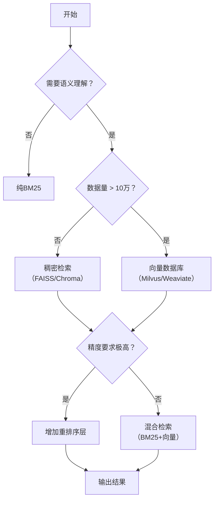

# 向量搜索技术

> 本文专为向量搜索新手设计，结合示例代码深度解析，系统梳理核心技术栈，提供可落地的实践路径。内容兼顾理论深度与工程实用性，助你构建扎实的认知框架。

---

## 一、示例文件深度解析：从代码看检索系统演进

### 📁 `01_bm25.py`：传统检索的基石
```python
# 核心流程示意
import jieba
from rank_bm25 import BM25Okapi

# 中文分词是关键前提
tokenized_corpus = [list(jieba.cut(doc)) for doc in documents]
bm25 = BM25Okapi(tokenized_corpus)
scores = bm25.get_scores(query_tokens)
```
**深度解读**：
- **中文特殊性**：英文天然空格分词，中文需依赖`jieba`等工具，分词质量直接影响检索效果
- **算法本质**：BM25是概率检索模型的工程优化版，通过`k1`（词频饱和度）、`b`（长度归一化）参数平衡长文档优势
- **新手启示**：无需GPU、毫秒级响应、结果可解释——是理解检索系统的“第一块积木”

### 📁 `02_hybrid.py`：现代混合检索系统范式
```mermaid
graph LR
    A[用户查询] --> B{双路检索}
    B --> C[BM25关键词匹配]
    B --> D[向量语义匹配]
    C --> E[分数归一化]
    D --> E
    E --> F[加权融合 α*BM25 + (1-α)*Vector]
    F --> G[Top-K结果返回]
```
**关键技术亮点**：
1. **医疗领域适配**：专业术语（如“心肌梗死”）需同时匹配关键词与语义
2. **分数归一化**：`Min-Max`标准化消除量纲差异（BM25原始分≈0-10，余弦相似度≈0-1）
3. **嵌入模型选型**：通义千问等中文优化模型显著提升医疗文本表征质量
4. **工程细节**：文档分块策略、元数据保留（问题/答案对结构）

**新手认知跃迁**：单一技术有边界，**组合创新**才是工业级系统的灵魂

---

## 二、向量搜索核心方法全景图谱

### 🔍 1. 稀疏检索：BM25（关键词匹配基石）
| 维度 | 详解 |
|------|------|
| **核心原理** | 基于词频统计的概率模型：`Score = Σ [IDF(q) × (f(q,D)×(k1+1)) / (f(q,D) + k1×(1-b+b×\|D\|/avgdl))]`• IDF：抑制常见词（“的”“是”）• 长度归一化：避免长文档天然占优 |
| **关键步骤** | 1. 文本清洗+分词 → 2. 构建倒排索引 → 3. 计算IDF → 4. 查询评分 → 5. 排序返回 |
| **适用场景** | ✅ 精确关键词匹配（法律条文、代码搜索）✅ 低资源环境（CPU即可）✅ 查询含专业术语/缩写（“CT"“PCR"）❌ 无法处理同义词/语义泛化 |
| **新手实践** | 用`rank_bm25`库5行代码实现，调试分词器观察效果变化 |

### 🌐 2. 稠密检索：向量语义搜索（深度学习驱动）
| 维度 | 详解 |
|------|------|
| **核心原理** | 将文本映射至高维语义空间（如768维）：• 语义相似 → 向量距离近（余弦相似度）• 模型学习：通过对比学习/掩码语言建模捕捉上下文语义 |
| **关键步骤** | 1. 选嵌入模型（中文：BGE/通义；英文：text-embedding-3-small）2. 文档分块向量化 → 3. 构建ANN索引（HNSW/IVF）4. 查询向量化 → 5. 近似最近邻搜索 → 6. 返回Top-K |
| **适用场景** | ✅ 语义泛化（“头疼”匹配“头痛缓解方法”）✅ 问答系统、对话理解✅ 跨语言检索（多语言嵌入模型）❌ 短查询效果波动、专业术语需领域微调 |
| **新手实践** | LangChain + ChromaDB 10行代码搭建，用PCA可视化向量聚类 |

### 🤝 3. 混合检索：BM25 + 向量（工业级黄金方案）
| 维度 | 详解 |
|------|------|
| **融合策略** | • **分数加权**：`final = α·norm(BM25) + (1-α)·norm(Vector)`（α=0.3~0.7）• **结果融合**：Recall@100取并集后重排序• **动态权重**：根据查询长度/领域自动调整α |
| **为何有效** | • BM25：捕获关键词信号（“阿司匹林剂量”）• 向量：理解语义意图（“吃多少药不伤胃”）• 互补短板：BM25怕语义漂移，向量怕关键词缺失 |
| **适用场景** | ✅ 医疗/法律等高精度领域（示例文件核心价值）✅ 用户查询表达多样（口语化/专业术语混杂）✅ 追求召回率与准确率平衡 |
| **调优技巧** | 用验证集网格搜索α；对专业术语加强BM25权重 |

### 🎯 4. 重排序（Re-ranking）：精度终极武器
| 维度 | 详解 |
|------|------|
| **工作流** | 召回阶段（BM25/向量）→ 获取Top-100 → Cross-Encoder精细打分 → 返回Top-5 |
| **技术本质** | • **Embedding模型**：双塔结构（查询/文档独立编码），快但精度有限• **Cross-Encoder**：拼接查询+文档联合编码，慢但精度高（如BGE-Reranker） |
| **适用场景** | ✅ 搜索引擎结果页（Top-10质量至关重要）✅ RAG中减少幻觉（确保上下文高度相关）⚠️ 计算开销大，仅用于小候选集 |
| **新手建议** | 先实现基础检索，效果瓶颈时再引入重排序 |

### 🗃️ 5. 向量数据库核心技术
| 缩写 | 英文全称 | 中文释义 | 技术定位 |
|------|-----------|-----------|----------|
| ANN | Approximate Nearest Neighbor | 近似最近邻搜索 | 向量检索的总目标：用可接受的精度损失换取数量级速度提升 |
| HNSW | Hierarchical Navigable Small World | 分层可导航小世界图 | 基于图的ANN索引，当前精度/速度平衡最佳方案之一 |
| IVF | Inverted File (Index) | 倒排文件（索引） | 源自搜索引擎，将向量聚类分桶加速检索 |
| PQ | Product Quantization | 乘积量化 | 向量压缩核心技术，大幅降低存储与计算开销 |
| IVF-PQ | Inverted File + Product Quantization | 倒排文件+乘积量化 | 工业界超大规模场景（亿级以上）黄金组合 |
| LSH | Locality-Sensitive Hashing | 局部敏感哈希 | 早期ANN方法，通过哈希碰撞近似相似向量（现较少用于高维） |
| ScaNN | Scalar Quantization + Approximate Nearest Neighbor | 标量量化+近似最近邻 | Google开源高效库，强调硬件友好性 |


## 三、LangChain新手实战指南

### 🚀 三步搭建混合检索系统
```python
# 1. 初始化检索器
from langchain.retrievers import BM25Retriever, EnsembleRetriever
from langchain.vectorstores import Chroma
from langchain.embeddings import HuggingFaceEmbeddings

bm25_retriever = BM25Retriever.from_texts(docs, k=5)
vector_retriever = Chroma.from_texts(docs, HuggingFaceEmbeddings(model_name="BAAI/bge-small-zh")).as_retriever(k=5)

# 2. 混合融合（自动归一化分数）
ensemble = EnsembleRetriever(
    retrievers=[bm25_retriever, vector_retriever],
    weights=[0.4, 0.6]  # 医疗场景建议向量权重稍高
)

# 3. 查询
results = ensemble.invoke("高血压患者能吃布洛芬吗？")
```

### 💡 新手必知优化技巧
| 问题 | 解决方案 | 工具推荐 |
|------|----------|----------|
| 中文分词不准 | 尝试`pkuseg`/`thulac` | `jieba.analyse.extract_tags` |
| 嵌入效果差 | 选领域适配模型 | 中文：BGE-M3、通义千问；英文：text-embedding-3-large |
| 结果不相关 | 增加重排序层 | `bge-reranker-base` + `CohereRerank` |
| 响应慢 | 调整索引参数 | ChromaDB: `hnsw:space=cosine` |

### 📊 方法选型决策树


---

## 四、学习路径与避坑指南

### 📚 新手成长路线
1. **筑基阶段**：手写BM25（理解TF-IDF演进），用`rank_bm25`跑通示例
2. **入门阶段**：LangChain + ChromaDB搭建向量检索，可视化向量分布
3. **进阶阶段**：实现混合检索，调参观察α对结果的影响
4. **高手阶段**：引入重排序，用MRR/NDCG量化评估系统

### ⚠️ 常见陷阱与对策
| 陷阱 | 现象 | 解决方案 |
|------|------|----------|
| 中文分词失效 | “心脏病”被切为“心/脏/病” | 自定义词典 + 领域词增强 |
| 向量“语义漂移” | “苹果手机”匹配“水果苹果” | 领域微调嵌入模型 |
| 混合分数失衡 | BM25分数碾压向量分数 | 严格Min-Max归一化 |
| 分块策略不当 | 关键信息被切断 | 按语义分块（`RecursiveCharacterTextSplitter` + overlap） |

---