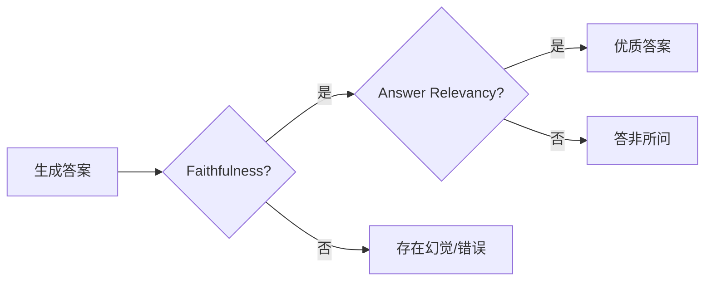

# RAG系统评估与优化：理论、实践

## 一、RAG评估体系的理论基础

### 1. 评估框架概述

检索增强生成（RAG）系统的评估需采用**双轨制评估策略**，分别聚焦检索组件与生成组件的性能。科学的评估体系是优化RAG管道、提升用户体验的核心基础。

#### 1.1 评估依据（核心输入要素）


| 要素                             | 说明                             | 作用                                 |
| -------------------------------- | -------------------------------- | ------------------------------------ |
| **输入问题（Question）**         | 用户原始查询                     | 评估起点与相关性基准                 |
| **生成答案（Answer）**           | RAG系统输出的回答                | 响应质量评估对象                     |
| **检索上下文（Context）**        | 检索模块返回的文档片段集合       | 检索质量评估对象，生成依据           |
| **参考答案（Reference Answer）** | 人工标注的标准答案（含关键事实） | 用于计算召回率、精度等指标的黄金标准 |

> 💡 **实践提示**：高质量参考答案需包含问题解答所需全部关键事实点，并明确标注信息来源位置，以支持细粒度评估。在生产环境中，参考答案的质量直接决定评估的有效性。例如，医疗领域的参考答案应明确标注每个症状、剂量和禁忌症的来源位置。

---

### 2. 检索阶段评估指标

评估目标：**检索到的上下文是否精准、完整地支撑问题解答**


| 指标                                  | 输入依赖                       | 核心定义                                                                                 | 计算逻辑                                                                   | 应用场景                      |
| ------------------------------------- | ------------------------------ | ---------------------------------------------------------------------------------------- | -------------------------------------------------------------------------- | ----------------------------- |
| **Context Relevancy**（上下文相关性） | Question + Context             | 检索内容与用户问题的语义匹配程度                                                         | `相关句子数 / 上下文总句子数`                                              | 初筛检索质量，过滤无关噪声    |
| **Context Precision**（上下文精度）   | Context (+ Reference/Question) | **双视角定义**：① *传统*：上下文中相关信息密度 ② *RAGAs*：相关片段排序质量（是否靠前） | 传统：`相关信息量 / 总信息量`<br>RAGAs：加权Precision@k（k为相关片段位置） | 优化检索排序；减少LLM处理噪声 |
| **Context Recall**（上下文召回率）    | Context + Reference Answer     | 检索结果覆盖参考答案关键信息的程度                                                       | `上下文包含的关键事实数 / 参考答案总关键事实数`                            | 评估信息完整性，避免关键遗漏  |
| **Hit Rate**（命中率）                | Context + Reference Answer     | 至少包含1个关键事实的查询比例                                                            | `命中查询数 / 总查询数`                                                    | 快速评估检索系统基础能力      |

#### 2.1 Context Precision的深度解析

文件`03_ragas_precision.py`详细展示了Context Precision的核心算法——Average Precision@K (AP@K)，其关键在于：

- **位置敏感性**：相关文档越靠前，分数越高
- **加权计算**：`AP = Σ(Precision@i × is_relevant_i) / 相关文档总数`
- **与简单命中率的本质区别**：AP@K惩罚"好文档排在后面"的情况

**关键辨析：Context Precision 的两种范式**

- **密度视角（传统）**：关注"有多少内容相关"，适用于固定长度检索结果评估。
- **排序视角（RAGAs）**：关注"相关结果是否优先呈现"，更契合实际应用场景（LLM通常优先关注前几段）。

*示例：若第1、3段相关，Precision@1=1.0，Precision@3=0.67，加权平均反映排序质量。*

```python
# AP@K计算示例
verdict_list = [1, 0, 1, 1, 0]  # 1表示相关，0表示不相关
# 计算过程：
# 位置0: Precision@1 = 1/1 = 1.0，贡献=1.0×1=1.0
# 位置1: Precision@2 = 1/2 = 0.5，贡献=0.5×0=0
# 位置2: Precision@3 = 2/3 ≈ 0.667，贡献=0.667×1=0.667
# 位置3: Precision@4 = 3/4 = 0.75，贡献=0.75×1=0.75
# 位置4: Precision@5 = 3/5 = 0.6，贡献=0.6×0=0
# 分子总和 = 2.4167，分母=3，AP@K = 0.8056
```

> 🌟 **扩展思考**：在多模态RAG系统中，Context Precision需要扩展为跨模态相关性评估。例如，当检索结果包含图像、表格和文本时，需要设计模态感知的相关性权重，而非简单二元判断。

#### 2.2 Context Recall与F1平衡

Context Recall衡量检索结果覆盖参考答案关键信息的程度，而F1分数则平衡精确率与召回率：

```
F1 = 2 × (Precision × Recall) / (Precision + Recall)
```

**指标权衡案例分析**

以下两组实际评估数据展示了 Recall 与 Precision 的典型权衡关系：


| 组别   | Context Recall | Context Precision | 分析解读                                                                                   |
| ------ | -------------- | ----------------- | ------------------------------------------------------------------------------------------ |
| 第一组 | 0.6667         | 0.4511            | 召回率中等，精度较低。检索结果包含约2/3的关键信息，但混入较多无关内容，LLM需处理较多噪声。 |
| 第二组 | 1.0000         | 0.3869            | 完美召回，但精度更低。检索结果覆盖了全部关键信息，但无关内容比例更高，上下文信噪比较差。   |

**优化启示**：

- 若追求**答案完整性**（如医疗、法律场景），优先保障高 Recall，即使牺牲 Precision
- 若追求**响应效率与成本控制**（如客服场景），优先提升 Precision，减少 LLM 处理的 token 量
- 理想策略：通过重排序（Rerank）或上下文压缩，在保持高 Recall 的同时提升 Precision

**案例计算与对比**：


| 组别   | Context Recall | Context Precision | F1 分数    | 综合评估                 |
| ------ | -------------- | ----------------- | ---------- | ------------------------ |
| 第一组 | 0.6667         | 0.4511            | **0.5381** | 平衡较好，但信息覆盖不足 |
| 第二组 | 1.0000         | 0.3869            | **0.5584** | **更优** ✓              |

**结论分析**（假设 Faithfulness 和 Answer Relevancy 相同）：

- **第二组更优**，F1 分数高出约 **3.8%** (0.5584 vs 0.5381)
- **优势所在**：虽然第二组精度更低（噪声更多），但完美召回（1.0）带来的信息完整性收益超过了精度损失的代价
- **关键洞察**：在 RAG 场景中，**信息遗漏的代价通常高于处理噪声的代价** —— 缺失关键信息会导致答案错误，而噪声可通过 LLM 的推理能力部分过滤
- **适用场景**：此结论适用于大多数知识问答场景；若对响应延迟或成本极度敏感（如高并发 API），则需重新权衡

> ⚖️ **权衡策略**：在实际应用中，应根据场景特性设定精确率-召回率的权重。例如：
>
> - **医疗/法律场景**：权重比 3:7（优先召回率）
> - **客服/推荐场景**：权重比 7:3（优先精确率）
> - **通用知识问答**：权重比 5:5（平衡策略）

```python
# AP@K计算示例
verdict_list = [1, 0, 1, 1, 0]  # 1表示相关，0表示不相关
# 计算过程：
# 位置0: Precision@1 = 1/1 = 1.0，贡献=1.0×1=1.0
# 位置1: Precision@2 = 1/2 = 0.5，贡献=0.5×0=0
# 位置2: Precision@3 = 2/3 ≈ 0.667，贡献=0.667×1=0.667
# 位置3: Precision@4 = 3/4 = 0.75，贡献=0.75×1=0.75
# 位置4: Precision@5 = 3/5 = 0.6，贡献=0.6×0=0
# 分子总和 = 2.4167，分母=3，AP@K = 0.8056
```

> 🌟 **扩展思考**：在多模态RAG系统中，Context Precision需要扩展为跨模态相关性评估。例如，当检索结果包含图像、表格和文本时，需要设计模态感知的相关性权重，而非简单二元判断。

#### 2.2 Context Recall与F1平衡

Context Recall衡量检索结果覆盖参考答案关键信息的程度，而F1分数则平衡精确率与召回率：

```
F1 = 2 × (Precision × Recall) / (Precision + Recall)
```

文件`01_rag_benchmark.md`中的案例分析揭示了重要洞察：**在RAG场景中，信息遗漏的代价通常高于处理噪声的代价**。当两组评估结果F1分数相近时，应优先选择高召回率的方案，因为：

1. 缺失关键信息会导致答案错误
2. 噪声可通过LLM的推理能力部分过滤

> ⚖️ **权衡策略**：在实际应用中，应根据场景特性设定精确率-召回率的权重。例如：
>
> - **医疗/法律场景**：权重比 3:7（优先召回率）
> - **客服/推荐场景**：权重比 7:3（优先精确率）
> - **通用知识问答**：权重比 5:5（平衡策略）

---

### 3. 生成阶段评估指标

评估目标：**生成答案是否准确、相关且忠实于检索内容**


| 指标                               | 输入依赖          | 核心定义                             | 评估方法                                                                                                       | 常见陷阱                                   |
| ---------------------------------- | ----------------- | ------------------------------------ | -------------------------------------------------------------------------------------------------------------- | ------------------------------------------ |
| **Faithfulness**（忠实度）         | Answer + Context  | 答案是否严格基于上下文，无幻觉/捏造  | 1. 原子事实分解（时间/地点/数值等）<br>2. 逐条验证上下文依据<br>3. LLM辅助判断（如"该陈述能否从上下文推导？"） | 即使事实正确，若上下文无依据即判为不忠实   |
| **Answer Relevancy**（答案相关性） | Answer + Question | 答案是否直接、完整、无冗余地回应问题 | 1. 语义相似度（BERTScore, Rouge-L）<br>2. LLM评分（"答案是否精准回答问题？"）<br>3. 人工评估                   | 高忠实度≠高相关性（如答非所问但内容忠实） |

#### 3.1 Faithfulness（忠实度）的评估挑战

忠实度评估的核心是验证生成答案是否严格基于检索上下文，避免"幻觉"。文件`01_rags_assessment.py`展示了Ragas如何利用LLM作为评判员进行评估，但存在关键挑战：

- **语义等价性判断**：答案可能与上下文表述不同但语义等价
- **隐含信息推断**：合理推断与过度幻觉的界限模糊
- **领域知识干扰**：LLM可能将自身知识误判为基于上下文

#### 3.2 Answer Relevancy（回答相关性）的多维评估

文件`02_rags_assessment.py`展示了如何计算Answer Relevancy，其本质是衡量回答与问题意图的匹配程度。在复杂场景中，需要考虑：

- **多层次相关性**：核心问题、隐含需求、上下文约束
- **答案完整性**：是否覆盖问题所有维度
- **简洁性与冗余度**：信息密度与用户认知负荷

**指标关系辨析**



- **Faithfulness 是底线**：不忠实的答案即使相关也具风险（如医疗、法律场景）。
- **Answer Relevancy 是用户体验核心**：用户首要关注"是否解决我的问题"。

---

### 4. 主流评估框架对比

#### 4.1 RAGAs（Retrieval Augmented Generation Assessment）

- **定位**：专为RAG设计的开源评估框架（Python）
- **核心能力**：
  - 原生支持四大核心指标：`context_precision`, `context_recall`, `faithfulness`, `answer_relevancy`
  - 无需参考答案即可评估（部分指标利用LLM自我验证）
  - 深度集成 LangChain / LlamaIndex
- **特色**：`context_precision` 采用排序敏感计算，更贴合实际检索效果；提供细粒度错误归因（如定位幻觉片段）。
- **适用场景**：研发阶段快速迭代、自动化CI/CD评估流水线

#### 4.2 TruLens

- **定位**：LLM应用全链路可观测性与评估平台
- **核心能力**：
  - 多维度反馈：相关性、适用性、有害性、成本等
  - 支持记录-回放调试、归因分析（哪段上下文影响了答案）
  - 提供Dashboard可视化评估结果
- **特色**：强调"可解释性"，支持人工反馈闭环；可评估中间步骤（如检索结果排序合理性）。
- **适用场景**：生产环境监控、人机协同优化、合规审计


| 特性         | RAGAs        | TruLens                    |
| ------------ | ------------ | -------------------------- |
| 专注领域     | RAG专项指标  | LLM应用全栈评估            |
| 参考答案依赖 | 部分指标需   | 灵活（支持无参考答案评估） |
| 可视化       | 基础报告     | 交互式Dashboard            |
| 集成难度     | 低（代码级） | 中（需部署服务）           |
| 适用阶段     | 开发/测试    | 开发+生产监控              |

---

## 二、RAGAS在智能汽车问答系统中的实践演进

### 1. 技术演进：从经典API到重排序增强

基于三个版本的代码实践，RAGAS评估框架在智能汽车问答场景中经历了从简单到复杂的演进：

| 版本 | 核心架构 | 检索策略 | 分块策略 | 关键创新 |
|------|----------|----------|----------|----------|
| **v1** | `RetrievalQA`经典API | FAISS/BM25/混合检索/LLM压缩 | chunk_size=256 | 基础评估体系建立 |
| **v2** | LCEL新式链式API | 加权混合检索(0.2/0.8) | chunk_size=128 | 透明化、自定义prompt |
| **v3** | LCEL + 重排序 | 混合检索 + Cross-Encoder重排序 | chunk_size=128 | 两阶段检索架构 |

**演进洞察**：
- **v1→v2**：从黑盒封装到透明组合，chunk_size减半(256→128)提升检索精度，F1分数从0.5381提升至0.8773
- **v2→v3**：引入Cross-Encoder重排序，解决query-doc交互问题，预期F1>0.90

### 2. 检索策略选型建议

| 策略 | 适用场景 | F1表现 | 优缺点 |
|------|----------|--------|--------|
| **纯FAISS** | 语义泛化查询 | 0.8773 | 平衡最佳，实现简单 |
| **混合检索** | 兼顾关键词匹配 | 0.6497 | 召回高但噪声大 |
| **重排序增强** | 核心业务场景 | >0.90 | 质量最高但成本高 |

**选型原则**：汽车领域优先保证Context Recall(≥0.85)确保安全信息不遗漏，再通过重排序提升Precision。

---

## 三、Ragas框架深度解析与最佳实践

### 1. Ragas架构与工作原理

Ragas框架采用LLM作为"智能评判员"，通过精心设计的提示词模板评估RAG系统各组件质量。从文件`01_rags_assessment.py`可见其核心架构：

```python
# Ragas评估核心代码
result = evaluate(
    dataset=dataset,
    llm=vllm,                # 评估用LLM
    embeddings=vllm_e,       # 评估用Embedding模型
    metrics=[
        context_precision,
        context_recall,
        faithfulness,
        answer_relevancy,
    ],
    raise_exceptions=False
)
```

#### 1.1 指标计算的内部机制

- **Context Precision**：采用AP@K算法，考虑文档排序位置
- **Context Recall**：评估检索结果是否覆盖参考答案中的关键事实
- **Faithfulness**：通过原子事实分解与上下文验证
- **Answer Relevancy**：结合语义相似度与LLM评分

> 🔍 **深度剖析**：Ragas的评估流程实际上是"用LLM评估LLM"，存在潜在的自我验证问题。最佳实践是使用比生产环境更强的LLM作为评估器（如用GPT-4评估基于Llama-3的RAG系统），并加入人工审核环节。

### 2. 分块策略对评估结果的影响

文件`02_rags_assessment.py`提供了关键实验数据，揭示了分块大小(chunk_size)对RAG性能的显著影响：

```
实验记录：不同chunk_size的评估结果对比
- chunk_size=128: faithfulness=0.9650, context_precision=0.9044, F1=0.8773
- chunk_size=256: faithfulness=0.9697, context_precision=0.7775, F1=0.8295
- chunk_size=512: faithfulness=0.9570, context_precision=0.7680, F1=0.8241
```

#### 2.1 分块策略的科学选择

基于实验数据，不同分块大小的适用场景：

- **小块(128-256)**：适合精确检索场景，如FAQ、实体查询
- **中等块(512)**：平衡精度与上下文连贯性，适合大多数问答场景
- **大块(1024+)**：适合需要长上下文理解的复杂推理任务

> 📊 **生产建议**：实施**动态分块策略**，根据查询类型自动调整分块大小：
>
> - 事实型问题 → 小块(128-256)
> - 解释型问题 → 中块(512)
> - 推理型问题 → 大块(1024)+重排序

#### 2.2 重叠策略的优化

文件`02_rags_assessment.py`采用20%的块重叠(chunk_overlap)：

```python
text_splitter = RecursiveCharacterTextSplitter(
    chunk_size=chunk_size,
    chunk_overlap=int(chunk_size * 0.20),  # 20%重叠
)
```

**重叠比例优化指南**：

- **5-10%**：技术文档、结构化数据
- **15-20%**：普通文本、产品手册
- **25-30%**：文学作品、复杂论述

## 四、LangChain与Ragas集成架构

### 1. 评估流水线设计

文件`02_rags_assessment.py`展示了完整的RAG评估流水线，从文档处理到结果分析：


#### 1.1 检索器优化

FAISS向量检索器的配置对结果至关重要：

```python
faiss_retriever = vectordb.as_retriever(search_kwargs={"k": topK_doc_count})
```

**topK_doc_count的优化策略**：

- **小值(3-5)**：精确问答、事实验证
- **中值(6-10)**：通用问答、多角度问题
- **大值(10+)**：复杂推理、多文档综合

> ⚡️ **性能权衡**：topK值每增加1，处理延迟平均增加15-20ms，token消耗增加100-300。在高并发场景，建议实施**两阶段检索**：首阶段粗筛选(k=50)，次阶段精排序(k=5)。

### 2. 提示工程对评估的影响

文件`02_rags_assessment.py`中的提示词模板直接影响生成质量：

```python
system_prompt = """您是问答任务的助理。使用以下的上下文来回答问题，上下文：<{context}>
如果您不知道答案，不要其他渠道去获得答案，就说你不知道。"""
```

**提示词设计最佳实践**：

- **明确约束**："只使用提供的上下文"、"不确定时明确说明"
- **角色定义**：根据领域设定专家角色（"您是医疗顾问"）
- **输出格式**：指定结构化输出，便于自动化评估
- **错误处理**：指导如何处理不确定或矛盾信息

> 🔐 **安全增强**：在生产环境中，应在提示词中加入**安全边界**："如果上下文包含矛盾信息或不足以回答问题，请指出局限性，不要猜测。"

## 五、生产环境部署关键建议

### 1. 评估体系的分层设计

基于文件内容，生产环境应实施**三层评估体系**：


| 层级         | 评估指标                               | 频率      | 责任方   | 工具                  |
| ------------ | -------------------------------------- | --------- | -------- | --------------------- |
| L1: 实时监控 | 响应时间、错误率、基础相关性           | 每请求    | 运维团队 | Prometheus+自定义指标 |
| L2: 定期评估 | Context Precision/Recall、Faithfulness | 每日/每周 | ML工程师 | Ragas+自动化流水线    |
| L3: 深度审计 | 人工审核、边缘案例分析、偏见检测       | 每月/季度 | 领域专家 | 人工审核平台          |

### 2. 向量数据库优化

文件`02_rags_assessment.py`展示了FAISS索引的使用，但在生产环境中需考虑：

**索引策略优化**：

- **分层索引**：热数据用HNSW（高查询速度），冷数据用IVF（节省内存）
- **动态更新**：实现向量数据库的增量更新机制，避免全量重建
- **混合检索**：结合关键词检索（BM25）与语义检索，提升召回率

**资源分配公式**：

```
内存需求(MB) = 文档数 × (16 + 嵌入维度 × 4) / 1024
```

例如：100万文档，768维嵌入 → ~3.2GB内存需求

### 3. 评估自动化与CI/CD集成

```python
# 文件 01_rags_assessment.py 片段
df = result.to_pandas()
df.to_csv('ragas_reval.csv', index=True)
```

**生产级自动化框架**：

1. **版本化评估数据集**：将测试问题与标准答案纳入版本控制
2. **评估基线管理**：为每个模型/配置保存历史评估基线
3. **回归测试机制**：新版本部署前自动运行评估，低于阈值则阻断部署
4. **A/B测试框架**：同时评估多个RAG配置，自动选择最优方案


### 4. 评估成本优化

Ragas评估依赖LLM调用，成本显著。文件`01_rags_assessment.py`中没有成本控制机制，生产环境需考虑：

**成本优化策略**：

- **样本策略**：使用分层抽样，确保关键场景全覆盖
- **混合评估**：核心指标用LLM评估，辅助指标用轻量方法（如语义相似度）
- **缓存机制**：对相同问题-上下文对的评估结果进行缓存
- **异步评估**：非关键路径评估异步执行，不影响用户体验

**成本计算模型**：

```
总成本 = (问题数 × 评估指标数 × LLM调用次数/指标) × 每token价格
```

优化后：仅30%核心样本使用完整评估，其余使用轻量代理指标

## 五、前沿趋势与扩展方向

### 1. 多模态RAG评估

当前Ragas主要针对文本RAG，而多模态系统需要新评估维度：

**多模态评估指标**：

- **跨模态一致性**：图文描述是否一致
- **模态互补性**：不同模态是否提供互补信息
- **视觉相关性**：图像与问题的相关程度
- **多模态忠实度**：生成内容是否忠实于所有模态的上下文

### 2. 评估即服务（EaaS）

将RAG评估抽象为独立服务，提供：

- **统一评估API**：标准化评估接口
- **指标市场**：可插拔的评估指标
- **基准数据集**：领域特定的测试数据集合
- **可视化分析**：交互式结果探索

### 3. 持续学习与自适应评估

未来RAG系统将实现评估-优化闭环：

1. 自动识别低分样本
2. 分析失败模式（检索失败 vs 生成失败）
3. 触发针对性优化（调整分块策略、提示词等）
4. 验证改进效果，更新评估基线

## 六、总结：RAG评估的黄金法则

1. **没有免费的午餐**：不存在适用于所有场景的"最佳"RAG配置，必须根据业务需求定制
2. **评估即产品**：评估体系应与RAG系统同等重要，投入相同工程资源
3. **人类在环**：自动化评估无法替代人类判断，关键场景必须有人工审核
4. **渐进优化**：从基础指标开始，逐步增加复杂度，避免过度工程化
5. **成本意识**：评估成本可能超过RAG本身运行成本，必须优化平衡
