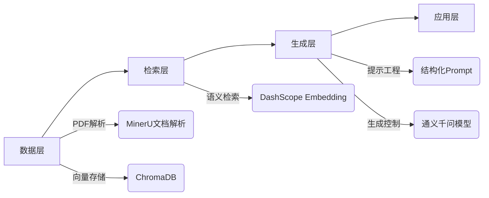

# RAG实战应用：金融报告智能问答系统深度解析

## 一、RAG架构全景透视

RAG（Retrieval-Augmented Generation）系统通过结合信息检索与生成模型，有效解决了大模型在专业领域知识不足、幻觉严重和数据时效性差三大核心问题。本文基于一个金融年报智能问答系统的实战案例，深入剖析RAG工程化落地的关键技术点与陷阱。

### 核心架构分层



## 二、关键技术创新点

### 1. 文档智能解析：超越传统PDF处理

> **核心价值**：传统RAG系统使用PyPDFLoader等简单工具，丢失90%以上的文档结构信息，导致金融报表等复杂文档问答效果极差。

**MinerU的优势**：
- **版面智能分析**：识别标题层级、表格、正文等文档元素
- **保留语义关联**：标题与下文内容保持关联，表格与标题/脚注保持关联
- **多模态处理**：同时处理文本、表格和图像内容

**实现要点**：
```python
# 注册YOLOv10模型为安全全局对象，避免PyTorch反序列化警告
torch.serialization.add_safe_globals([doclayout_yolo.nn.tasks.YOLOv10DetectionModel])

# 调用MinerU智能解析
do_parse(
    output_dir=output_path,
    pdf_file_names=[pdf_file_name],
    pdf_bytes_list=[pdf_bytes],
    p_lang_list=["ch"],  # 指定中文文档
    backend="pipeline"   # 使用完整处理流程
)
```

> **易错点**：YOLO模型反序列化警告处理不当会导致程序崩溃，必须提前注册安全全局对象。

### 2. 智能分块策略：专业领域知识驱动

> **核心洞察**：通用文本分块(如RecursiveCharacterTextSplitter)在金融文档中失效，因为它忽略了文档的层级结构和特殊元素。

**分块策略对比**：
| 策略 | 通用分块 | 金融文档智能分块 |
|------|----------|------------------|
| 标题处理 | 与正文混合 | 标题单独成块，标记层级 |
| 表格处理 | 转为纯文本 | 保留HTML结构，单独处理 |
| 语义连贯性 | 机械切割 | 保持章节完整性 |
| 元数据保留 | 有限 | 保留页码、标题关联等 |

**实现亮点**：
```python
def _split_into_chunks(self, content_data, chunk_size, overlap):
    # 标题识别：text_level>0表示各级标题
    if item.get('text_level', 0) > 0:
        # 标题作为新块的开头，标记为二级标题格式
        current_chunk = [f"## {text}"]
    
    # 表格单独处理，保留HTML格式
    elif item.get('type') == 'table':
        # 小表格直接作为一个块
        # 大表格按行切分，保留表头
        table_chunks = self._split_table_into_chunks(table_body, chunk_size)
```

**大表格切分特殊处理**：
```python
def _split_table_into_chunks(self, table_html, chunk_size):
    # 保留表头，每块包含表头+部分数据行
    table_head = rows[1]  # 表头行
    for row in rows[2:]:
        # 确保每块都包含表头，保持表格语义完整
        if current_chunk_size + len(row_content) > chunk_size:
            current_chunk = '<table>' + table_head + row_content
```

> **深度解析**：金融报表中的表格往往包含关键数据，拆分时必须保留表头，否则会导致数据语义丢失。例如，财务三表(资产负债表、利润表、现金流量表)的表头定义了数据的财务含义。

### 3. 向量检索优化：领域适应性增强

**嵌入模型选择**：
- 采用DashScope的text-embedding-v2，针对中文金融术语优化
- 全量更新策略简化实现，但生产环境应采用增量更新

```python
# 清空旧数据（全量更新）
if self.collection.count() > 0:
    existing_ids = self.collection.get(include=[])['ids']
    self.collection.delete(ids=existing_ids)
```

> **性能陷阱**：全量更新在文档量大时会导致服务不可用，应记录文档哈希值，仅更新变更部分。

### 4. 提示工程：降低金融领域幻觉风险

**结构化Prompt设计**：
```python
prompt = f"""
请你扮演一个专业的财务报告分析师。
根据下面提供的几段从《厦门灿坤实业股份有限公司2019年年度报告》中摘录的文字，
严谨且仅依据这些信息来回答用户的问题。
如果提供的信息不足以回答问题，请明确告知"根据现有信息无法回答"。
---
相关文档内容：
{context_text}
---
用户问题：{question}
"""
```

**设计原则**：
1. **角色明确化**：指定"财务报告分析师"角色，引导专业回答风格
2. **来源明确化**：明确信息来源于特定报告，增强可信度
3. **约束明确化**：强调"仅依据这些信息"，显著减少幻觉
4. **不确定性处理**：预设无法回答时的标准回应，避免编造

## 三、关键难点与解决方案

### 1. 文档结构保留挑战

**问题**：金融文档具有严格的层级结构(章节→子章节→表格/正文)，通用RAG丢失这些结构信息。

**解决方案**：
- 通过MinerU保留文档逻辑结构
- 分块时识别标题层级，创建"标题+内容"关联块
- 为每个块添加丰富的元数据(metadata)

```python
# 合并文档级元数据和块级元数据
metadatas.append({
    **doc_metadata, 
    **chunk['metadata'],
    'section_title': current_title  # 保留当前章节标题
})
```

### 2. 表格数据处理挑战

**问题**：财务数据80%存在于表格中，普通文本分块使表格数据失去关联性。

**创新方案**：
- 识别表格类型(资产负债表、利润表等)
- 拆分大表格时保持表头完整
- 保留表格HTML结构，而非转为纯文本

```python
# 表格块元数据包含丰富信息
metadata = {
    'chunk_type': 'table',
    'page_idx': item.get('page_idx', 0),
    'has_caption': len(item.get('table_caption', [])) > 0,
    'has_footnote': len(item.get('table_footnote', [])) > 0,
    'table_type': self._classify_table_type(table_body)  # 表格类型识别
}
```

### 3. 检索-生成对齐挑战

**问题**：检索到的文档片段与问题不完全匹配，导致生成质量下降。

**优化策略**：
- 检索结果重排序：基于元数据(如chunk_type='table')调整相关性
- 动态上下文窗口：根据问题类型调整检索结果数量
- 不确定性检测：当相关度低于阈值时，拒绝回答

```python
def ask_question(self, question):
    results = self.rag_system.query_documents(question)
    # 检查检索结果相关度
    if results['distances'][0][0] > DISTANCE_THRESHOLD:
        return "根据现有资料，无法准确回答此问题。", []
```

## 四、生产环境部署教训

### 1. 全量更新 vs 增量更新

**当前实现**：
```python
# 清空旧数据（全量更新）
if self.collection.count() > 0:
    self.collection.delete(ids=existing_ids)
```

**生产环境应改为**：
```python
# 1. 计算新文档哈希
# 2. 仅更新变更的文档
# 3. 保留未变更文档的向量
unchanged_ids = self._find_unchanged_documents(new_docs)
self.collection.delete(ids=changed_ids)
self.collection.add(new_embeddings, new_docs, new_metadatas, new_ids)
```

### 2. 模型选择权衡

**代码中使用qwen-turbo**：
```python
response = dashscope.Generation.call(
    model='qwen-turbo',  # 速度快，成本低
    messages=[{'role': 'user', 'content': prompt}],
    result_format='message'
)
```

**实际部署建议**：
| 场景 | 模型选择 | 理由 |
|------|----------|------|
| 简单查询(如数字查找) | qwen-turbo | 速度快，精度足够 |
| 复杂分析(如同比变化) | qwen-plus | 平衡性能与准确性 |
| 高风险决策(如审计) | qwen-max | 最大化准确性，不惜成本 |

### 3. 错误处理与监控

**当前错误处理不足**：
```python
if response.status_code == HTTPStatus.OK:
    # 正常处理
else:
    # 简单错误提示
    return "抱歉，调用大语言模型时出错，无法生成答案。"
```

**生产级改进**：
- 实现重试机制（指数退避）
- 错误分类处理（API限流、参数错误、服务不可用）
- 完整的错误日志记录与告警
- 降级策略（当LLM失败时，返回检索结果摘要）

## 五、效果评估与优化方向

### 1. 质量评估维度

**金融问答系统特有评估指标**：
- **数字精确率**：回答中数字是否100%准确
- **引用完整性**：是否包含数据来源位置
- **不确定性识别率**：无法回答时正确拒绝的比例
- **表格理解准确率**：对财务表格语义的理解程度

### 2. 优化方向

1. **多粒度检索**：
   - 首次检索确定相关章节
   - 二次检索在相关章节内精准定位
   
2. **领域微调**：
   - 对Embedding模型进行金融术语微调
   - 构建财务表格专用解析器

3. **验证机制**：
   - 数字交叉验证（如验证三表数据一致性）
   - 引用溯源可视化（高亮显示来源位置）